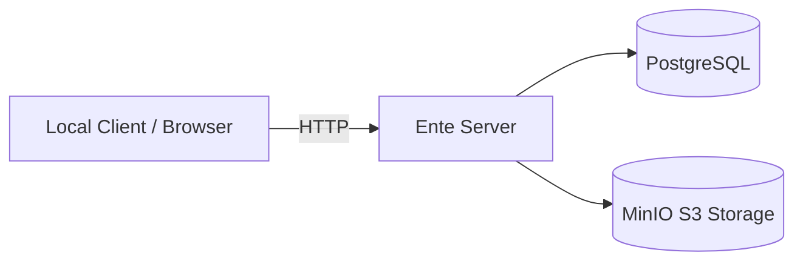

<p align="center">
  
</p>

# Ente Docker Self-Host Installer

Run Ente locally in minutes with Docker or Podman.

This repository is a local self-host deployment wrapper for Ente.
It uses the official server image and does not modify Ente itself.

- Ente image: `ghcr.io/ente-io/server:latest`
- Runtime support: Docker and Podman
- Target: Linux (Ubuntu/Debian first)

## Quick Start

```bash
git clone https://codeberg.org/<user>/ente-docker
cd ente-docker
./install.sh
```

After install, the stack is up and managed with:

```bash
./ente start
./ente stop
./ente logs
./ente reset --yes
```

## Features

- Docker support
- Podman support (preferred when available)
- Zero-config default mode
- Optional interactive setup (`./install.sh --interactive`)
- Secure auto-generated secrets
- Persistent local data directory (`~/.ente-docker`)

## Architecture



## What `install.sh` Does

1. Detects runtime in this order: Podman, then Docker.
2. Installs Docker automatically on Debian/Ubuntu when no runtime exists.
3. Creates local working directory (`~/.ente-docker` by default).
4. Generates secure secrets and writes `.env` automatically.
5. Copies compose files into the working directory.
6. Starts the stack using the right compose command.
7. Prints URLs and management commands.

## Runtime Commands

Installer and CLI automatically choose the correct compose command:

- Docker: `docker compose` (or `docker-compose` fallback)
- Podman: `podman compose` (or `podman-compose` fallback)

## Configuration

Default install is non-interactive and requires no manual edits.

Optional flags:

```bash
./install.sh --interactive
./install.sh --engine podman
./install.sh --engine docker
./install.sh --data-dir ~/.ente-docker
./install.sh --minio-console yes
```

Environment template is available in `.env.example`.
Generated runtime `.env` is stored in `~/.ente-docker/.env`.

## Ports and Networking

- Exposed by default:
  - `127.0.0.1:8080` -> Ente API
- Not exposed by default:
  - PostgreSQL
  - MinIO API
  - MinIO Console (optional)

Internal services communicate on a private compose network.

## FAQ

### Docker or Podman?

Both are supported. Podman is preferred automatically when available.

### Do I need internet?

Only for pulling container images (and package installation if Docker must be installed).

### Is data local?

Yes. Data is stored on your machine under `~/.ente-docker` unless you choose a different path.

## Troubleshooting

- Check runtime selection:

  ```bash
  ./ente config
  ```

- View logs:

  ```bash
  ./ente logs
  ```

- Recreate stack:

  ```bash
  ./ente stop
  ./ente start
  ```

- Reset all local data (destructive):

  ```bash
  ./ente reset --yes
  ```

## Security Notes

- Secrets are generated locally by the installer.
- The default bind address is localhost.
- Review firewall rules if you expose services beyond localhost.
